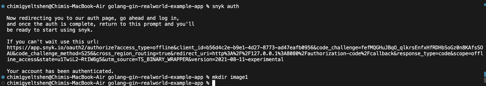
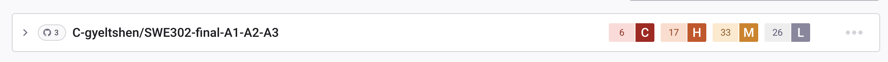
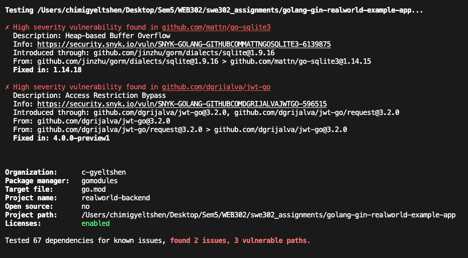
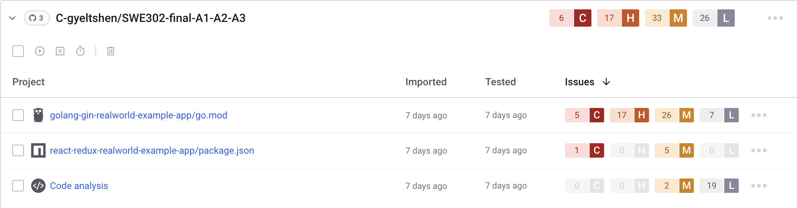
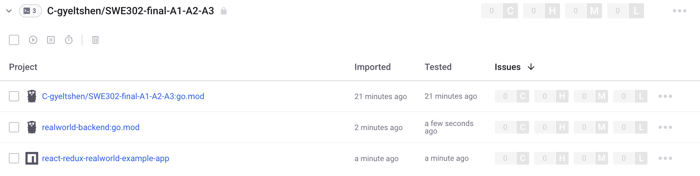
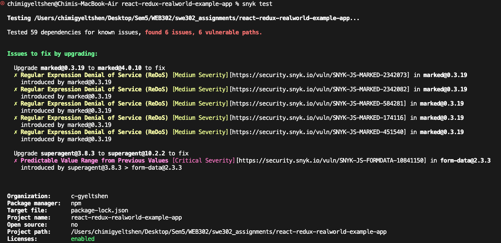
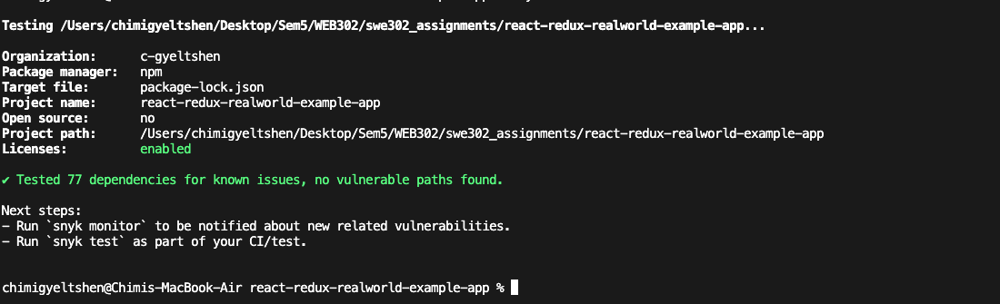

# Assignment 2: Static & Dynamic Application Security Testing (SAST & DAST)

## Overview
Tn this assignment we will perform security testing on the provideed web applicatlion using both Static Application Security Testing (SAST) and Dynamic Application Security Testing (DAST) tools. We will identify the vulnerabilities present in the application, analyze the findings, and implement fixes to improve the security posture of the application.

## Learning Objectives
- Understand the difference between SAST and DAST
- Use industry-standard security testing tools (Snyk, SonarQube, OWASP ZAP)
- Identify common security vulnerabilities (OWASP Top 10)
- Analyze security findings and prioritize remediation
- Implement security fixes and verify improvements

---

## Part A: Static Application Security Testing (SAST)

### Prerequisites
- Both backend and frontend code accessible
- Docker installed (for SonarQube)
- npm/Node.js and Go installed

---

## Task 1: SAST with Snyk

### 1.1 Setup Snyk

#### Installation
```bash
# Install Snyk CLI
npm install -g snyk
```

```bash
# Authenticate (requires free Snyk account)
snyk auth
```


#### Create Snyk Account
1. Visit [https://snyk.io/](https://snyk.io/)
2. Sign up for a free account
3. Complete authentication in CLI
4. Link your project repository to Snyk dashboard

    

### 1.2 Backend Security Scan (Go)

#### Run Snyk on Backend
```bash
cd golang-gin-realworld-example-app

# Test for vulnerabilities
snyk test

# Test and generate JSON report
snyk test --json > snyk-backend-report.json

# Test for open source vulnerabilities
snyk test --all-projects

# Monitor project (uploads to Snyk dashboard)
snyk monitor
```

### `Analyze Findings`



- #### `Security Scan Results (Before Fixes)`

    A Snyk security scan identified 2 high-severity vulnerabilities in project dependencies:

    1. **go-sqlite3 (v1.14.15)**: Heap-based Buffer Overflow vulnerability. Requires upgrade to v1.14.18+
    2. **jwt-go (v3.2.0)**: Access Restriction Bypass vulnerability allowing potential JWT token forgery. Requires upgrade to v4.0.0+ or migration to the maintained fork `github.com/golang-jwt/jwt`

    **Status**: ⚠️ Vulnerabilities identified - security updates recommended before production deployment.

    Total dependencies tested: 67 | Vulnerable paths: 3

     

- #### `Security Scan Results (After Fixes)`

    After updating the vulnerable dependencies, a follow-up Snyk scan confirmed that all previously identified vulnerabilities have been resolved.

    Total dependencies tested: 67 | Vulnerable paths: 0

    

    


### 1.3 Frontend Security Scan (React)

#### Run Snyk on Frontend
```bash
cd react-redux-realworld-example-app

# Test for vulnerabilities
snyk test

# Generate JSON report
snyk test --json > snyk-frontend-report.json

# Test for code vulnerabilities (not just dependencies)
snyk code test

# Generate code analysis report
snyk code test --json > snyk-code-report.json

# Monitor project
snyk monitor
```
### `Analyze Findings`



- #### Security Scan Results

    A Snyk security scan identified 6 vulnerabilities across 2 packages:

    1. **marked (v0.3.19)**: 5 Medium-severity Regular Expression Denial of Service (ReDoS) vulnerabilities. Requires upgrade to v4.0.10+
    2. **form-data (v2.3.3)**: 1 Critical-severity Predictable Value Range vulnerability (introduced via superagent@3.8.3). Requires upgrading superagent to v10.2.2+

    **Status**: ⚠️ Security updates required - particularly critical vulnerability in form-data dependency.

    Total dependencies tested: 59 | Vulnerable paths: 6

    

- #### `Security Scan Results (After Fixes)`

    After updating the vulnerable dependencies, a follow-up Snyk scan confirmed that all previously identified vulnerabilities have been resolved.

    Total dependencies tested: 59 | Vulnerable paths: 0

    

    


