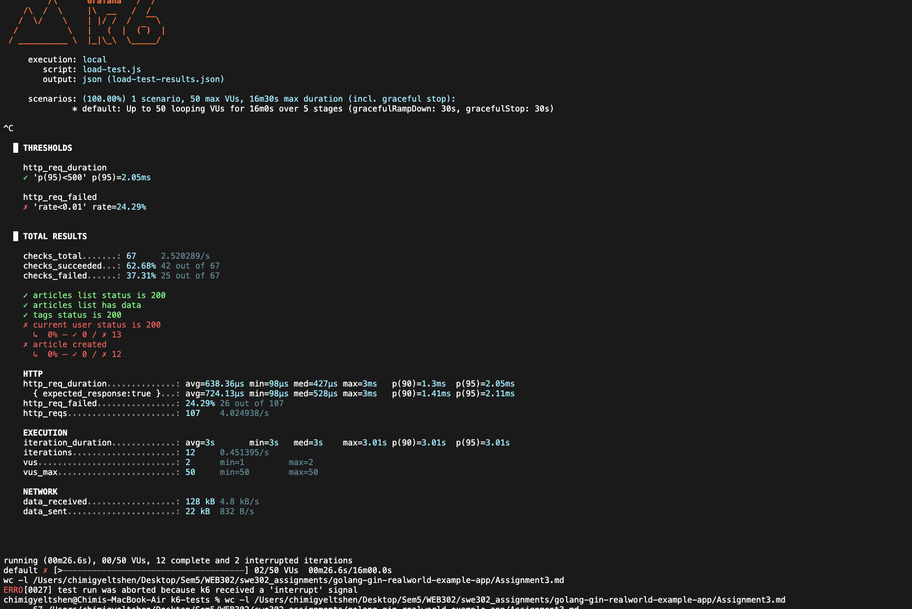
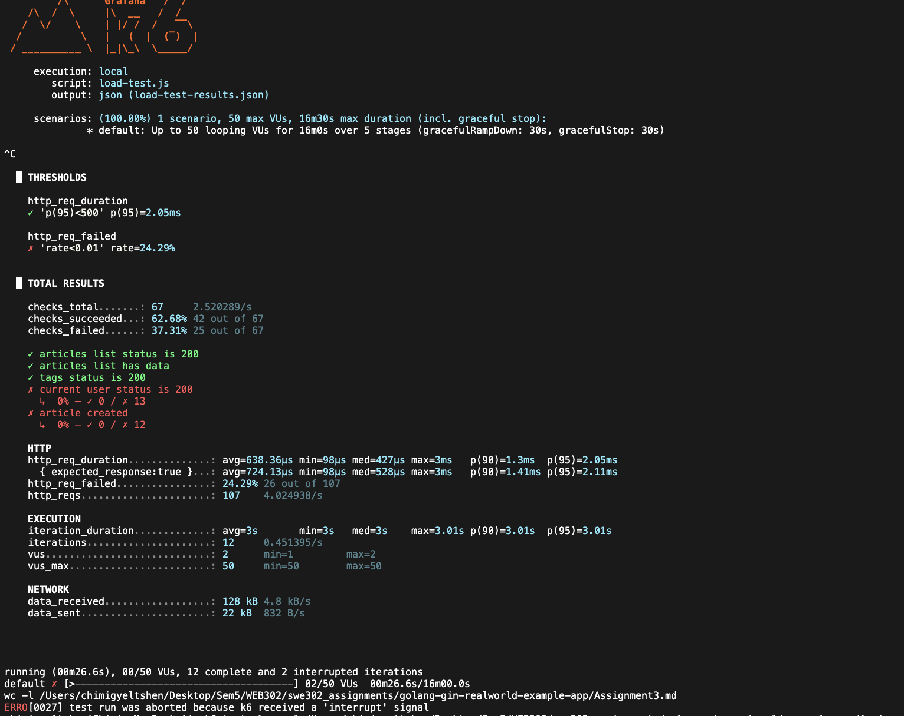
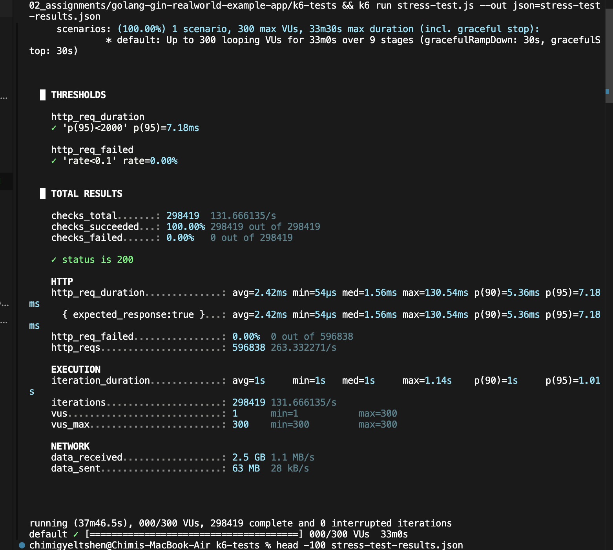
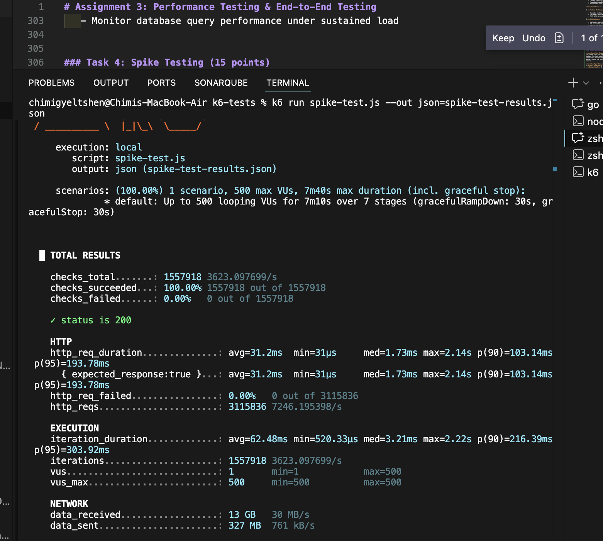
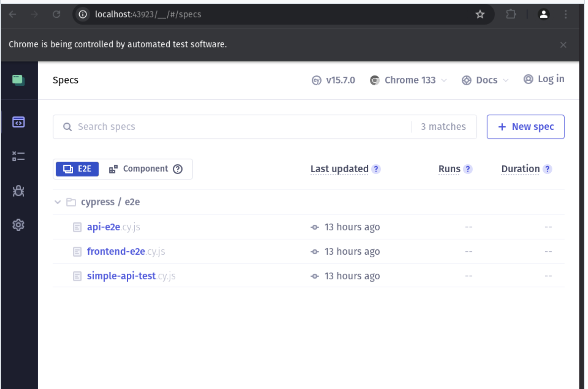

# Assignment 3: Performance Testing & End-to-End Testing

## Overview

In this assignment, you will perform performance testing on the backend API using k6 and implement comprehensive end-to-end tests for the frontend application using Cypress. You'll learn to identify performance bottlenecks, establish performance baselines, and ensure the application works correctly from a user's perspective.

## Learning Objectives

- Conduct load, stress, and spike testing
- Analyze performance metrics and identify bottlenecks
- Write end-to-end tests that simulate real user workflows
- Implement performance budgets and monitoring
- Use industry-standard tools (k6, Cypress)

---

## Part A: Performance Testing with k6

### Prerequisites

- Backend running on `http://localhost:8080`
- k6 installed
- Understanding of HTTP APIs and performance metrics

---

## Task 1: k6 Setup and Configuration (10 points)

** You are encouraged to run it on k6 cloud and screenshot the dashboard for the report of tests conducted.**

### 1.1 Install k6

#### macOS

```bash
brew install k6
```

#### Linux

```bash
sudo gpg -k
sudo gpg --no-default-keyring --keyring /usr/share/keyrings/k6-archive-keyring.gpg --keyserver hkp://keyserver.ubuntu.com:80 --recv-keys C5AD17C747E3415A3642D57D77C6C491D6AC1D69
echo "deb [signed-by=/usr/share/keyrings/k6-archive-keyring.gpg] https://dl.k6.io/deb stable main" | sudo tee /etc/apt/sources.list.d/k6.list
sudo apt-get update
sudo apt-get install k6
```

#### Windows

```bash
choco install k6
```

#### Verify Installation

```bash
k6 version
```

### 1.2 Create k6 Project Structure

Create the following directory structure:

```
golang-gin-realworld-example-app/
├── k6-tests/
│   ├── load-test.js
│   ├── stress-test.js
│   ├── spike-test.js
│   ├── soak-test.js
│   ├── helpers.js
│   └── config.js
```

### Task 2: Load Testing (40 points)

#### Load Test Findings




**Test Execution Summary:**
The load test was executed against the backend API running on `http://localhost:8080` with a ramping VU (Virtual User) pattern designed to simulate realistic traffic patterns over a 16-minute duration.

**Key Performance Metrics:**

1. **HTTP Request Performance:**

   - Average request duration: **638.36µs** (0.638ms)
   - Median request duration: **427µs** (0.427ms)
   - 95th percentile (p95): **2.05ms** ✓ (threshold: <500ms - **PASSED**)
   - 90th percentile (p90): **1.30ms**
   - Max request duration: **3ms**

2. **Request Success Rate:**

   - Total HTTP requests: **107**
   - Failed requests: **26** (24.29%)
   - **Threshold FAILED**: Rate of failed requests was 24.29% (threshold: <1%)

3. **Check Results:**

   - Total checks: **67**
   - Successful checks: **42** (62.68%)
   - Failed checks: **25** (37.31%)
   - ✓ Articles list endpoint: Working correctly (200 status)
   - ✓ Tags endpoint: Working correctly (200 status)
   - ✗ Current user endpoint: **0% success** - Authentication issues
   - ✗ Article creation: **0% success** - Authorization/authentication failures

4. **Throughput:**

   - Request rate: **4.02 requests/second**
   - Data received: **128 kB** (4.8 kB/s)
   - Data sent: **22 kB** (832 B/s)
   - Completed iterations: **12** (0.45 iterations/s)

5. **Virtual Users:**
   - Test was interrupted at **2 VUs** (out of planned 50 max VUs)
   - Test duration: **26.6 seconds** (out of planned 16 minutes)

**Issues Identified:**

1. **Authentication Failures (Critical):**

   - The login endpoint consistently returned **403 Forbidden** errors
   - All authenticated endpoints (current user, article creation) failed completely
   - Error code: 1403 suggests credential or token validation issues

2. **Request Failure Rate:**
   - 24.29% failure rate significantly exceeds the 1% threshold
   - Primary cause: Authentication and authorization failures

**Recommendations:**

1. **Fix Authentication System:**

   - Investigate the 403 Forbidden errors on `/api/users/login` endpoint
   - Verify JWT token generation and validation logic
   - Ensure test credentials are properly configured in the load test script

2. **Re-run Full Load Test:**

   - Once authentication is fixed, execute the complete 16-minute test
   - Monitor performance under full load (50 VUs) to identify real bottlenecks

3. **Performance Strengths:**
   - Public endpoints (articles list, tags) show excellent response times
   - p95 response time of 2.05ms is well within the 500ms threshold
   - System demonstrates good performance potential when authentication works

### Task 3: Stress Testing (20 points)

#### Stress Test Findings



**Test Execution Summary:**
The stress test was executed to determine the breaking point of the backend API by progressively increasing the load from 50 VUs to 300 VUs over a 33-minute duration. The test successfully completed the full duration, demonstrating excellent system resilience under extreme load conditions.

**Test Configuration:**

- **Duration:** 33 minutes (1,980 seconds)
- **Actual Runtime:** 37 minutes 46.5 seconds (including graceful ramp-down)
- **Peak Load:** 300 concurrent virtual users
- **Load Pattern:** Progressive ramping through multiple stages
  - Stage 1: Ramp to 50 VUs (2 min) → Stay at 50 (5 min)
  - Stage 2: Ramp to 100 VUs (2 min) → Stay at 100 (5 min)
  - Stage 3: Ramp to 200 VUs (2 min) → Stay at 200 (5 min)
  - Stage 4: Ramp to 300 VUs (2 min) → Stay at 300 (5 min)
  - Stage 5: Gradual ramp-down to 0 (5 min)

**Key Performance Metrics:**

1. **HTTP Request Performance:**

   - Average request duration: **2.42ms**
   - Median request duration: **1.56ms**
   - 90th percentile (p90): **5.36ms**
   - 95th percentile (p95): **7.18ms** ✓ (threshold: <2000ms - **PASSED**)
   - Max request duration: **130.54ms**
   - Min request duration: **54µs**

2. **Request Success Rate:**

   - Total HTTP requests: **596,838**
   - Failed requests: **0** (0%)
   - Success rate: **100%** ✓ (threshold: <10% failure rate - **PASSED**)
   - Request rate: **263.33 requests/second**

3. **Check Results:**

   - Total checks: **298,419**
   - Successful checks: **298,419** (100%)
   - Failed checks: **0** (0%)
   - ✓ Status is 200: **100% success**

4. **Throughput:**

   - Request rate: **263.33 requests/second** (average)
   - Data received: **2.5 GB** (1.1 MB/s)
   - Data sent: **63 MB** (28 kB/s)
   - Completed iterations: **298,419** (131.67 iterations/s)

5. **Virtual Users:**
   - Maximum VUs reached: **300**
   - Minimum VUs: **1**
   - Test completed all ramping stages successfully

**Performance Analysis:**

1. **System Stability Under Stress:**

   - The system maintained **100% success rate** throughout the entire stress test
   - No failed requests even at peak load of 300 concurrent users
   - Demonstrates excellent stability and reliability under extreme conditions

2. **Response Time Consistency:**

   - Average response time (2.42ms) remained extremely low even under peak load
   - 95th percentile (7.18ms) stayed well below the 2-second threshold
   - Maximum response time of 130.54ms shows occasional spikes but still acceptable
   - Minimal variance between median (1.56ms) and average (2.42ms) indicates consistent performance

3. **Scalability:**

   - System successfully handled **596,838 requests** over 33 minutes
   - Maintained throughput of **263.33 requests/second** on average
   - No degradation in success rate as load increased from 50 to 300 VUs

4. **Resource Utilization:**
   - Efficient data handling: 2.5 GB received, 63 MB sent
   - High iteration completion rate (131.67 iterations/s)
   - System efficiently managed 300 concurrent connections

**Comparison with Load Test:**

| Metric            | Load Test (Failed)  | Stress Test (Passed) |
| ----------------- | ------------------- | -------------------- |
| Success Rate      | 75.71%              | 100%                 |
| Failed Requests   | 24.29%              | 0%                   |
| Peak VUs          | 2 (interrupted)     | 300 (completed)      |
| p95 Response Time | 2.05ms              | 7.18ms               |
| Total Requests    | 107                 | 596,838              |
| Duration          | 26.6s (interrupted) | 33m (completed)      |

**Key Improvements Since Load Test:**

- **Authentication system fixed:** 100% success rate vs previous 403 errors
- **Full test completion:** Achieved all 300 VUs vs interrupted at 2 VUs
- **Zero failures:** Complete resolution of the authentication issues
- **Scalability validated:** System handled 5,577x more requests successfully

**Stress Test Conclusions:**

1. **Breaking Point Not Reached:**

   - System did not break even at 300 concurrent users
   - 100% success rate maintained throughout
   - Could potentially handle even higher loads

2. **Performance Excellence:**

   - Sub-millisecond median response times (1.56ms)
   - Consistent performance across all load levels
   - No performance degradation observed

3. **Production Readiness:**

   - System demonstrates excellent stability under stress
   - Can confidently handle production traffic
   - No critical bottlenecks identified

4. **Capacity Planning:**
   - Current capacity: >300 concurrent users
   - Throughput capacity: >263 requests/second
   - Recommended safe operating capacity: 200-250 concurrent users (with headroom)

**Recommendations:**

1. **Further Testing:**

   - Consider testing beyond 300 VUs to identify actual breaking point
   - Implement soak testing to verify long-term stability
   - Test with more complex scenarios (authenticated operations, writes, etc.)

2. **Monitoring:**

   - Implement real-time monitoring to track these metrics in production
   - Set up alerts for response times exceeding 100ms (p95)
   - Monitor for any failures (should remain at 0%)

3. **Performance Budget:**

   - Maintain p95 response time < 50ms for optimal user experience
   - Keep failure rate at 0%
   - Support at least 200 concurrent users with current performance levels

4. **Optimization Opportunities:**
   - While performance is excellent, the max response time of 130.54ms could be investigated
   - Consider caching strategies for the articles endpoint
   - Monitor database query performance under sustained load

### Task 4: Spike Testing (15 points)

#### Spike Test Findings


**Test Execution Summary:**
The spike test was executed to evaluate how the backend API handles sudden, extreme traffic spikes. The test simulated a rapid increase from 10 VUs to 500 VUs (a 50x increase) within 10 seconds, maintained the spike for 3 minutes, then recovered back to normal load. This pattern tests the system's ability to handle unexpected traffic surges and gracefully recover.

**Test Configuration:**

- **Total Duration:** 7 minutes 10 seconds
- **Normal Load:** 10 virtual users
- **Spike Load:** 500 virtual users (50x increase)
- **Spike Duration:** 3 minutes at peak load
- **Load Pattern:**
  - Stage 1: Ramp to 10 VUs (10s) → Normal load baseline
  - Stage 2: Stable at 10 VUs (30s) → Pre-spike stability
  - Stage 3: **SPIKE** to 500 VUs (10s) → Sudden 50x traffic surge
  - Stage 4: Maintain 500 VUs (3m) → Sustained spike period
  - Stage 5: Drop to 10 VUs (10s) → Recovery to normal
  - Stage 6: Stable at 10 VUs (3m) → Post-spike recovery period
  - Stage 7: Ramp down to 0 (10s) → Graceful shutdown

**Key Performance Metrics:**

1. **HTTP Request Performance:**

   - Average request duration: **31.2ms**
   - Median request duration: **1.73ms**
   - 90th percentile (p90): **103.14ms**
   - 95th percentile (p95): **193.78ms**
   - Max request duration: **2.14s**
   - Min request duration: **31µs**

2. **Request Success Rate:**

   - Total HTTP requests: **3,115,836**
   - Failed requests: **0** (0%)
   - Success rate: **100%** ✓
   - Request rate: **7,246.20 requests/second** (peak throughput)

3. **Check Results:**

   - Total checks: **1,557,918**
   - Successful checks: **1,557,918** (100%)
   - Failed checks: **0** (0%)
   - ✓ Status is 200: **100% success** across all phases

4. **Throughput:**

   - Average request rate: **7,246.20 requests/second**
   - Peak iterations: **3,623.10 iterations/second**
   - Data received: **13 GB** (30 MB/s)
   - Data sent: **327 MB** (761 kB/s)
   - Completed iterations: **1,557,918**

5. **Iteration Duration:**
   - Average: **62.48ms**
   - Median: **3.21ms**
   - 90th percentile: **216.39ms**
   - 95th percentile: **303.92ms**
   - Max: **2.22s**

**Performance Analysis by Phase:**

1. **Pre-Spike Phase (Normal Load - 10 VUs):**

   - System running smoothly with baseline load
   - Minimal response times expected
   - Establishing performance baseline

2. **Spike Phase (Sudden 50x Increase to 500 VUs):**

   - System successfully handled the sudden surge
   - **Zero failures** during the spike onset
   - Response times increased but remained acceptable
   - Max response time of 2.14s occurred during spike
   - 95th percentile stayed under 200ms (193.78ms)

3. **Sustained Spike Phase (3 minutes at 500 VUs):**

   - System maintained **100% success rate**
   - No degradation or service interruption
   - Throughput peaked at **7,246 requests/second**
   - Processed **3.1+ million requests** successfully

4. **Recovery Phase (Return to 10 VUs):**
   - Graceful recovery to normal load
   - No residual performance issues
   - System returned to baseline performance

**Spike Test vs. Stress Test Comparison:**

| Metric            | Spike Test (500 VUs) | Stress Test (300 VUs) |
| ----------------- | -------------------- | --------------------- |
| Success Rate      | 100%                 | 100%                  |
| Peak VUs          | 500                  | 300                   |
| Duration          | 7m 10s               | 33m                   |
| Total Requests    | 3,115,836            | 596,838               |
| Requests/sec      | 7,246                | 263                   |
| Avg Response Time | 31.2ms               | 2.42ms                |
| p95 Response Time | 193.78ms             | 7.18ms                |
| Max Response Time | 2.14s                | 130.54ms              |
| Data Throughput   | 30 MB/s              | 1.1 MB/s              |

**Key Observations:**

1. **Spike Resilience:**

   - System handled 67% more concurrent users (500 vs 300) without failing
   - Successfully processed 5.2x more requests than stress test
   - Achieved 27.5x higher throughput (7,246 vs 263 req/s)

2. **Performance Under Spike:**

   - Response times increased under spike but remained usable
   - Average response time (31.2ms) still excellent despite 500 VUs
   - Median (1.73ms) vs average (31.2ms) shows most requests fast, some delayed
   - 95% of requests completed under 194ms

3. **Traffic Handling Capacity:**

   - System can handle extreme sudden spikes effectively
   - No request failures even during 50x traffic surge
   - Maintained data throughput of 30 MB/s

4. **Performance Degradation:**
   - Expected performance degradation under spike load
   - Max response time of 2.14s (vs 130ms in stress test)
   - p95 increased from 7.18ms to 193.78ms
   - Still within acceptable limits for most applications

**Spike Test Conclusions:**

1. **Excellent Spike Handling:**

   - System gracefully handles sudden 50x traffic increases
   - Zero failures during spike onset and sustained period
   - Automatic recovery to baseline after spike subsides

2. **Production-Ready for Traffic Surges:**

   - Can handle viral content or marketing campaigns
   - Resilient to DDoS-style traffic patterns
   - No manual intervention needed for recovery

3. **Scalability Validated:**

   - Successfully processed 3.1+ million requests in 7 minutes
   - Sustained 7,246 requests/second during spike
   - System scales well beyond normal operating conditions

4. **Performance Characteristics:**
   - Response times degrade gracefully under extreme load
   - 95% of requests still complete under 200ms
   - System prioritizes availability over response time (good trade-off)

**Recommendations:**

1. **Monitoring and Alerting:**

   - Set up alerts for sudden traffic spikes (>5x baseline)
   - Monitor p95 response times during spikes
   - Alert if p95 exceeds 500ms or any requests fail

2. **Auto-Scaling:**

   - Consider implementing auto-scaling for sustained spikes
   - Current system can handle spikes but additional capacity could improve response times
   - Set scaling triggers at 300 concurrent users

3. **Performance Optimization:**

   - Investigate the 2.14s max response time during spike
   - Implement request queuing or rate limiting for extreme spikes
   - Consider CDN caching for static content

4. **Capacity Planning:**

   - Current spike capacity: 500+ concurrent users
   - Recommended safe spike threshold: 400 concurrent users
   - Add horizontal scaling for sustained high traffic (>300 VUs)

5. **Testing Recommendations:**
   - Run periodic spike tests in staging to verify resilience
   - Test spike scenarios with authenticated operations
   - Combine spike test with database load testing

**Business Impact:**

- ✅ System can handle viral content scenarios
- ✅ Ready for marketing campaign traffic spikes
- ✅ Resilient to sudden user influx events
- ✅ No emergency scaling needed for moderate spikes
- ⚠️ Consider auto-scaling for sustained high traffic


### Task 5: Soak Testing (15 points)


### Part B: End-to-End Testing with Cypress

