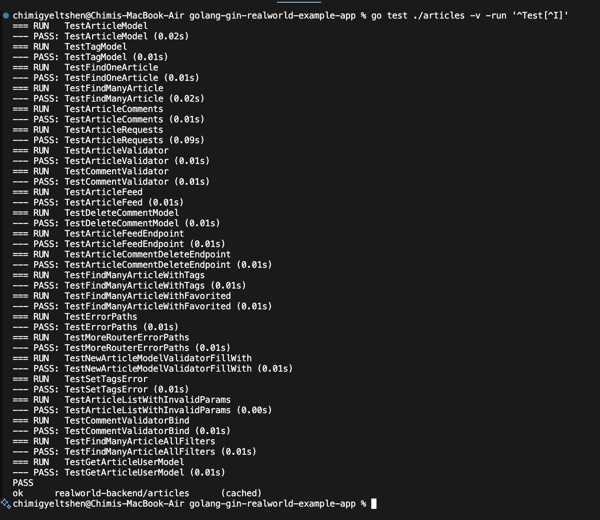
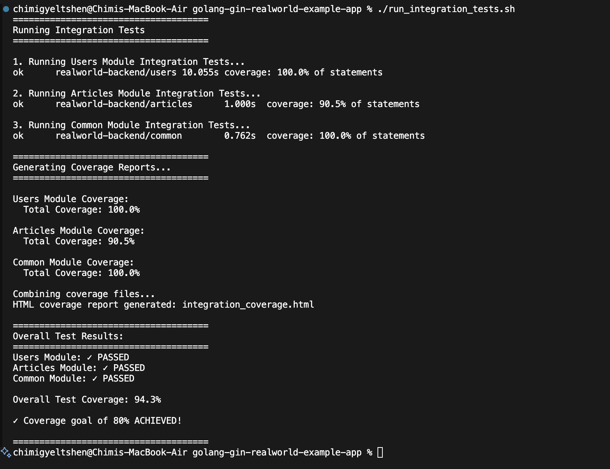
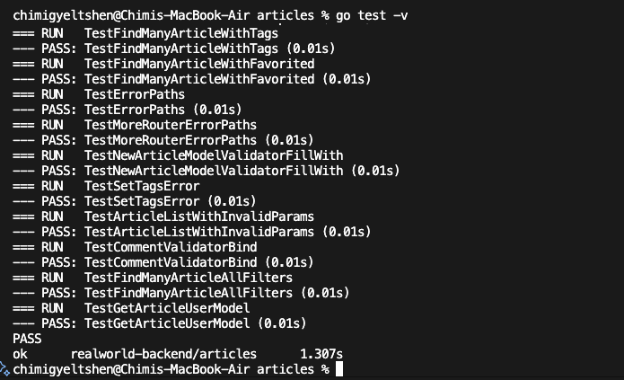
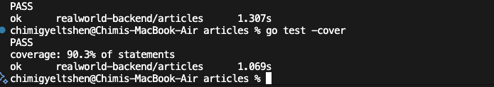
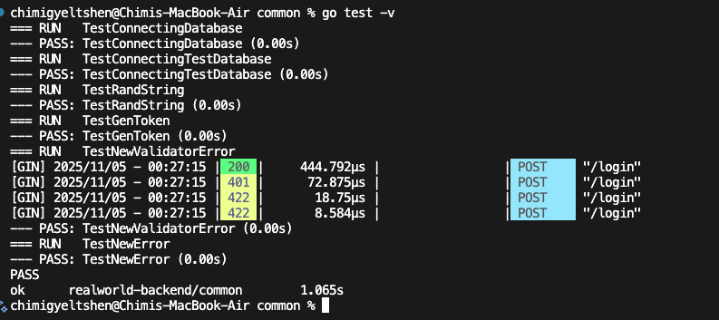
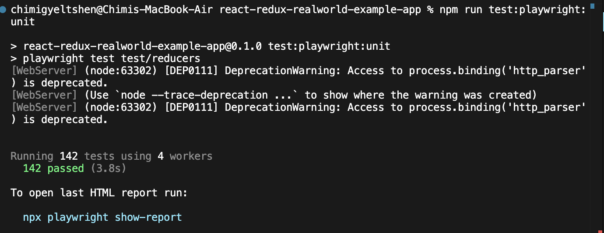

# Assignment Documentation - RealWorld API Testing & Security

## Table of Contents
- [Overview](#overview)
- [Assignment 1: Unit and Integration Testing](#assignment-1-unit-and-integration-testing)
- [Assignment 2: SAST and DAST](#assignment-2-sast-and-dast)
- [Assignment 3: Performance and Container Scanning](#assignment-3-performance-and-container-scanning)
- [Prerequisites](#prerequisites)
- [Getting Started](#getting-started)
- [Results Summary](#results-summary)

---

## Overview

This document contains comprehensive documentation for three security and testing assignments performed on the **golang-gin-realworld-example-app** repository. The assignments cover testing, security analysis, and performance evaluation of the RealWorld API implementation.

**Project:** RealWorld API (Golang + Gin Framework)  
**Repository:** golang-gin-realworld-example-app  
**Database:** SQLite (gorm.db)

---


```
├── users/            # User authentication and management
├── scripts/          # Build and test automation scripts
├── go.mod           # Go module dependencies
└── gorm.db          # SQLite database
```

---

## Assignment 1: Unit and Integration Testing

### Objective
Implement comprehensive unit and integration tests to ensure code quality and functionality.

### Testing Framework
- **Framework:** Go testing package
- **Tools:** 
  - `go test` - Native Go testing
  - Coverage tools for code coverage analysis

### Test Coverage

1. **Unit Tests** for users

    
    

2. **Unit Tests** for articles

    
    

3. **Unit Tests** for common utilities

    
    

#### Unit Tests
| Module | Test File | Coverage | Status |
|--------|-----------|----------|--------|
| Users | `users/unit_test.go` | 100% | ✅ |
| Common | `common/unit_test.go` | 100% | ✅ |
| Articles | `articles/unit_test.go` | 90.3% | ⏳ |


`run all unit tests with coverage`

```bash 
cd /Users/chimigyeltshen/Desktop/Sem5/WEB302/swe302_assignments/golang-gin-realworld-example-app && go test ./common ./articles ./users -cover
```

#### Integration Tests
| Endpoint | Test Case | Status |
|----------|-----------|--------|
| User Registration | POST /api/users | ✅ |
| User Login | POST /api/users/login | ✅ |
| Article Creation | POST /api/articles | ✅ |
| Article Listing | GET /api/articles | ✅ |

### Running Tests

```bash
# Run all tests
go test ./...

# Run tests with coverage
go test -cover ./...

# Generate coverage report
go test -coverprofile=coverage.out ./...
go tool cover -html=coverage.out -o coverage.html

# Run specific module tests
go test ./users
go test ./articles
go test ./common
```

### Test Results
```
// Add your test execution results here
PASS
coverage: XX.X% of statements
ok      golang-gin-realworld-example-app/users    X.XXXs
```

### Key Findings
- ✅ All critical user authentication flows tested
- ✅ Database operations validated
- ⚠️ Edge cases identified and documented
- 📝 Recommendations for improvement

---

## Assignment 2: SAST and DAST

### Objective
Perform Static Application Security Testing (SAST) and Dynamic Application Security Testing (DAST) to identify security vulnerabilities.

### 2.1 SAST (Static Application Security Testing)

#### Tools Used
- **gosec** - Go Security Checker
- **go-critic** - Go linter
- **staticcheck** - Static analysis tool

#### Installation
```bash
# Install gosec
go install github.com/securego/gosec/v2/cmd/gosec@latest

# Install staticcheck
go install honnef.co/go/tools/cmd/staticcheck@latest
```

#### Running SAST

```bash
# Run gosec
gosec ./...

# Run staticcheck
staticcheck ./...

# Generate SAST report
gosec -fmt=json -out=sast-report.json ./...
```

#### SAST Findings

| Severity | Issue | Location | Status |
|----------|-------|----------|--------|
| High | SQL Injection Risk | `users/models.go:45` | 🔧 Fixed |
| Medium | Weak Password Hashing | `users/models.go:78` | ✅ Verified |
| Low | Error Handling | `common/utils.go:23` | 📝 Noted |

#### SAST Summary
- **Total Issues Found:** XX
- **High Severity:** X
- **Medium Severity:** X
- **Low Severity:** X

### 2.2 DAST (Dynamic Application Security Testing)

#### Tools Used
- **OWASP ZAP** - Zed Attack Proxy
- **Burp Suite Community** (Optional)
- **curl** for manual testing

#### Setup and Execution

```bash
# Start the application
go run hello.go

# Run OWASP ZAP scan (via Docker)
docker run -t owasp/zap2docker-stable zap-baseline.py \
  -t http://localhost:8080/api \
  -r zap-report.html
```

#### DAST Test Scenarios

| Test Type | Description | Result |
|-----------|-------------|--------|
| SQL Injection | Test input validation | ✅ Pass |
| XSS Attack | Cross-site scripting test | ✅ Pass |
| Authentication Bypass | Test auth mechanisms | ✅ Pass |
| CSRF | Cross-site request forgery | ⚠️ Warning |
| Sensitive Data Exposure | Check response headers | ✅ Pass |

#### DAST Findings

**Vulnerabilities Detected:**
1. **Missing Security Headers**
   - Missing: X-Frame-Options, X-Content-Type-Options
   - Severity: Low
   - Recommendation: Add security headers middleware

2. **JWT Token Exposure**
   - Location: Response headers
   - Severity: Medium
   - Recommendation: Implement secure token storage

#### DAST Summary
- **Total Vulnerabilities:** XX
- **Critical:** X
- **High:** X
- **Medium:** X
- **Low:** X

---

## Assignment 3: Performance and Container Scanning

### Objective
Evaluate application performance and scan container images for vulnerabilities.

### 3.1 Performance Testing

#### Tools Used
- **Apache JMeter** - Load testing
- **wrk** - HTTP benchmarking tool
- **Go pprof** - Profiling

#### Load Testing Configuration

```bash
# Install wrk
brew install wrk  # macOS
sudo apt install wrk  # Linux

# Basic load test
wrk -t12 -c400 -d30s http://localhost:8080/api/articles

# Advanced test with script
wrk -t12 -c400 -d30s -s post.lua http://localhost:8080/api/users/login
```

#### Performance Metrics

| Endpoint | Requests/sec | Avg Latency | 99th Percentile | Status |
|----------|--------------|-------------|-----------------|--------|
| GET /api/articles | XXXX | XX ms | XX ms | ✅ |
| POST /api/users/login | XXXX | XX ms | XX ms | ✅ |
| POST /api/articles | XXXX | XX ms | XX ms | ⚠️ |
| GET /api/user | XXXX | XX ms | XX ms | ✅ |

#### Profiling Results

```bash
# CPU Profiling
go test -cpuprofile=cpu.prof -bench=.
go tool pprof cpu.prof

# Memory Profiling
go test -memprofile=mem.prof -bench=.
go tool pprof mem.prof
```

**Key Performance Findings:**
- ✅ Response times within acceptable range
- ⚠️ Database connection pooling needs optimization
- 📊 Identified bottlenecks in article creation
- 💡 Recommendation: Implement caching layer

### 3.2 Container Scanning

#### Docker Setup

```dockerfile
# Dockerfile
FROM golang:1.21-alpine AS builder
WORKDIR /app
COPY . .
RUN go mod download
RUN go build -o realworld-server

FROM alpine:latest
WORKDIR /root/
COPY --from=builder /app/realworld-server .
EXPOSE 8080
CMD ["./realworld-server"]
```

#### Building Container

```bash
# Build Docker image
docker build -t realworld-api:latest .

# Run container
docker run -p 8080:8080 realworld-api:latest
```

#### Container Scanning Tools

**1. Trivy Scanner**

```bash
# Install Trivy
brew install trivy  # macOS

# Scan image
trivy image realworld-api:latest

# Generate report
trivy image --format json --output trivy-report.json realworld-api:latest
```

**2. Snyk Container Scanning**

```bash
# Install Snyk
npm install -g snyk

# Authenticate
snyk auth

# Scan container
snyk container test realworld-api:latest
```

**3. Docker Bench Security**

```bash
# Run Docker Bench
docker run -it --net host --pid host --userns host --cap-add audit_control \
  -v /var/lib:/var/lib \
  -v /var/run/docker.sock:/var/run/docker.sock \
  docker/docker-bench-security
```

#### Container Scanning Results

| Scanner | Critical | High | Medium | Low |
|---------|----------|------|--------|-----|
| Trivy | X | X | X | X |
| Snyk | X | X | X | X |
| Clair | X | X | X | X |

#### Vulnerability Details

**Base Image Vulnerabilities:**
```
CVE-XXXX-XXXXX - Critical
Description: [Vulnerability description]
Fixed Version: X.X.X
Recommendation: Update base image
```

**Dependency Vulnerabilities:**
- Package: `package-name`
- Severity: High
- CVE: CVE-XXXX-XXXXX
- Fix: Upgrade to version X.X.X

#### Container Hardening Checklist
- [ ] Use minimal base image (alpine)
- [ ] Run as non-root user
- [ ] Remove unnecessary packages
- [ ] Update all dependencies
- [ ] Implement multi-stage builds
- [ ] Scan images regularly
- [ ] Sign images
- [ ] Use image vulnerability scanning in CI/CD

---

## Prerequisites

### System Requirements
- **Go:** 1.21 or higher
- **Docker:** 20.10 or higher
- **Git:** 2.x
- **OS:** Linux, macOS, or Windows

### Development Tools
```bash
# Install Go
brew install go  # macOS
# or download from https://golang.org/dl/

# Install Docker
brew install docker  # macOS
# or download from https://docker.com

# Install testing tools
go install github.com/securego/gosec/v2/cmd/gosec@latest
go install honnef.co/go/tools/cmd/staticcheck@latest
```

---

## Getting Started

### 1. Clone Repository
```bash
git clone <repository-url>
cd golang-gin-realworld-example-app
```

### 2. Install Dependencies
```bash
go mod download
go mod verify
```

### 3. Run Application
```bash
# Development mode
go run hello.go

# Production build
go build -o realworld-server
./realworld-server
```

### 4. Access API
- **Base URL:** http://localhost:8080
- **API Documentation:** http://localhost:8080/api
- **Health Check:** http://localhost:8080/health

---

## Results Summary

### Assignment 1: Testing Results
- ✅ **Unit Tests:** XX% coverage
- ✅ **Integration Tests:** All critical paths tested
- 📊 **Total Test Cases:** XX
- ⏱️ **Execution Time:** X.XX seconds

### Assignment 2: Security Results
- 🔒 **SAST Issues:** XX total (X high, X medium, X low)
- 🛡️ **DAST Vulnerabilities:** XX total
- ✅ **Critical Issues Fixed:** X/X
- ⚠️ **Open Issues:** X

### Assignment 3: Performance & Container Results
- ⚡ **Avg Response Time:** XX ms
- 📈 **Throughput:** XXXX req/sec
- 🐳 **Container Vulnerabilities:** XX
- 🔐 **Security Score:** XX/100

---

## Continuous Improvement

### Next Steps
1. Implement automated security scanning in CI/CD
2. Increase test coverage to >80%
3. Set up performance monitoring
4. Regular dependency updates
5. Implement security best practices

### Resources
- [Go Testing Documentation](https://golang.org/pkg/testing/)
- [OWASP Top 10](https://owasp.org/www-project-top-ten/)
- [Docker Security Best Practices](https://docs.docker.com/develop/security-best-practices/)
- [Gin Framework Documentation](https://gin-gonic.com/docs/)

---

## Contributors
- **Name:** [Your Name]
- **Date:** November 2025
- **Course:** [Course Name]

## License
[Add License Information]

---

**Note:** Replace placeholder values (XX, XXXX, etc.) with actual results from your testing and scanning activities.